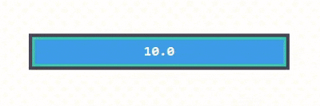

# TimerBar

A lightweight, flicker-free dual countdown bar overlay for Windows, built with AutoHotkey v2 and GDI+. Designed for tracking cooldowns in games like Diablo 4, but fully configurable for any use case.



## Features

- **Dual nested timers** – A short timer bar sits on top of a long timer bar. As the short bar shrinks, the long bar becomes visible behind it.
- **Visual urgency phases** – The long bar transitions through three color phases (green → yellow → red) to signal when action is needed.
- **Alert border** – After the short timer expires, the border gradually shifts to red with increasing intensity. In the red phase, the border can grow in thickness for additional urgency.
- **Flicker-free rendering** – All drawing is done offscreen via GDI+ and composited atomically using `UpdateLayeredWindow`. No AHK controls are used.
- **Click-through overlay** – The bar never captures mouse input. All clicks pass through to the application underneath.
- **Key passthrough** – The trigger key is forwarded to the foreground application (e.g. Diablo 4 skill activation) while simultaneously starting the timer.
- **Multi-monitor support** – Configure which monitor the bar appears on. Press `ScrollLock` to display monitor indices on all screens.
- **Fully configurable** – All timings, sizes, offsets, colors, and behavior can be adjusted in the configuration block at the top of the script.

## Requirements

- [AutoHotkey v2](https://www.autohotkey.com/) (v2.0 or later)
- Windows 10 / 11

## Installation

1. Install AutoHotkey v2 if you haven't already.
2. Download `TimerBar.ahk` or clone this repository.
3. Double-click `TimerBar.ahk` to run.

## Usage

| Key | Action |
|---|---|
| `4` (configurable) | Start / restart the countdown timer |
| `ScrollLock` | Show monitor indices on all screens (auto-hides after 3s) |

Press the trigger key at any time to reset the timer back to 100%.

## Configuration

All settings are at the top of `TimerBar.ahk`:

### General

| Variable | Default | Description |
|---|---|---|
| `TIMER_LONG` | `53` | Long timer duration in seconds |
| `TIMER_SHORT` | `36` | Short timer duration in seconds |
| `TRIGGER_KEY` | `"4"` | Key that starts / resets the timer |
| `BAR_WIDTH` | `300` | Bar width in pixels |
| `BAR_HEIGHT` | `40` | Bar height in pixels |
| `UPDATE_MS` | `50` | Render interval in milliseconds |
| `BAR_OPACITY` | `200` | Overall opacity (0–255) |
| `BORDER` | `4` | Border thickness in pixels |
| `BAR_OFFSET_X` | `0` | Horizontal offset from center (positive = right) |
| `BAR_OFFSET_Y` | `90` | Vertical offset from center (positive = down) |
| `MONITOR` | `2` | Target monitor index |
| `BORDER_GROW` | `2.0` | Border growth factor in red phase (1.0 = off) |
| `RED_PHASE` | `0.5` | When the red phase starts within the action window (0.0–1.0) |
| `TIME_FORMAT` | `"MM:SS"` | Time display format: `"MM:SS"`, `"MM:SS.ms"`, `"SS"`, `"SS.ms"`, or `""` (hidden) |

### Colors

All colors use `0xRRGGBB` format.

| Variable | Default | Description |
|---|---|---|
| `CLR_BAR_BG` | `0x16213e` | Bar background (empty area) |
| `CLR_BORDER` | `0x1a1a2e` | Border in normal state |
| `CLR_BORDER_ALERT` | `0xFF0000` | Border at full alert intensity |
| `CLR_LONG_GREEN` | `0x00b894` | Long bar while short timer is running |
| `CLR_LONG_YELLOW` | `0xfdcb6e` | Long bar in yellow phase |
| `CLR_LONG_RED` | `0xe94560` | Long bar in red phase |
| `CLR_SHORT` | `0x0984e3` | Short timer bar |
| `CLR_TEXT` | `0xffffff` | Countdown text |

## How It Works

```
┌──────────────────────────────────────┐
│ Border (grows + turns red over time) │
│  ┌──────────────────────────────┐    │
│  │ Long timer   (green/yellow/red)│    │
│  │  ┌────────────────────┐      │    │
│  │  │ Short timer (blue) │      │    │
│  │  └────────────────────┘      │    │
│  │            00:42              │    │
│  └──────────────────────────────┘    │
└──────────────────────────────────────┘
```

1. Both timers start simultaneously when the trigger key is pressed.
2. The **short bar** (blue) shrinks from left to right, revealing the **long bar** behind it.
3. Once the short timer expires, the **action window** begins:
   - The long bar turns **yellow** and the border starts shifting toward red.
   - At the configurable `RED_PHASE` threshold, the bar turns **red** and the border begins growing (if `BORDER_GROW > 1.0`).
4. When the long timer expires, the overlay disappears.
5. Pressing the trigger key at any point resets both timers.

## Anti-Cheat Compatibility

TimerBar does **not** simulate, inject, or re-send any keyboard input. The trigger key is registered with AutoHotkey's tilde (`~`) prefix, which means:

- The **original hardware keypress passes through to the game unmodified**. AHK simply listens in parallel and runs the timer callback alongside it.
- There is no `Send`, `SendInput`, or `SendEvent` call anywhere in the script. The game receives the exact same native input it would without the script running.
- The overlay is a standard Windows layered window with click-through — it does not hook into, attach to, or modify the game process in any way.

This is fundamentally different from macro or automation tools that intercept a key, suppress it, and then artificially re-send it. Such synthetic input can be flagged by anti-cheat systems. TimerBar avoids this entirely by never touching the input stream.

> **Note:** While this approach is designed to be as non-invasive as possible, no third-party tool can guarantee compatibility with every anti-cheat implementation. Use at your own discretion.

## License

[MIT](LICENSE)
